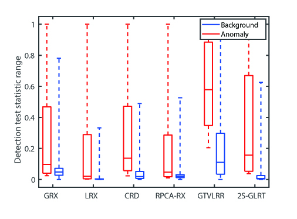

# Box-Plot-or-Statistical-Separability-Analysis-figure
This is a demo program for Box-plot figure or statistical separability analysis figure, which can be used for hyperspectral target detection,  anomaly detetion or change detection and so on. 

**Example:**<br />


Fig.1. The Box-plot/Statistical separability analysis figure for hyperspectral anomaly detection.


# Prerequisites
**MATLAB R2018a**<br />

# Source
For the description and instruction of specific box-plot program, please refer to the following paper:

**Related Papers:**

- [Multipixel Anomaly Detection With Unknown Patterns for Hyperspectral Imagery](https://ieeexplore.ieee.org/abstract/document/9404853)
- [Collaborative Representation with Background Purification and Saliency Weight for Hyperspectral Anomaly Detection](https://www.sciengine.com/publisher/scp/journal/SCIS/doi/10.1007/s11432-020-2915-2?slug=abstract)
- [Hyperspectral Change Detection Based on Multiple Morphological Profiles](https://ieeexplore.ieee.org/document/9469924)
- [Three-Order Tucker Decomposition and Reconstruction Detector for Unsupervised Hyperspectral Change Detection](https://ieeexplore.ieee.org/document/9451632)


# Citation
If these code is helpful for you, please cite  the following papers:

**BibTex Format:**<br />
```
@article{liu2021multipixel,
  title={Multipixel Anomaly Detection With Unknown Patterns for Hyperspectral Imagery},
  author={Liu, Jun and Hou, Zengfu and Li, Wei and Tao, Ran and Orlando, Danilo and Li, Hongbin},
  journal={IEEE Transactions on Neural Networks and Learning Systems},
  year={2021},
  publisher={IEEE}
}
```
```
@article{houcollaborative,
  title={Collaborative Representation with Background Purification and Saliency Weight for Hyperspectral Anomaly Detection},
  author={Hou, Zengfu and Wei, Li and Tao, Ran and SHI, Weihua},
  journal={SCIENCE CHINA Information Sciences},
  publisher={Science China Press}
}
```
```
@ARTICLE{9469924,
author={Hou, Zengfu and Li, Wei and Li, Lu and Tao, Ran and Du, Qian},
journal={IEEE Transactions on Geoscience and Remote Sensing},
title={Hyperspectral Change Detection Based on Multiple Morphological Profiles},
year={2021},
volume={},
number={},
pages={1-12},
doi={10.1109/TGRS.2021.3090802}}
```
```
@article{hou2021three,
  title={Three-Order Tucker Decomposition and Reconstruction Detector for Unsupervised Hyperspectral Change Detection},
  author={Hou, Zengfu and Li, Wei and Tao, Ran and Du, Qian},
  journal={IEEE Journal of Selected Topics in Applied Earth Observations and Remote Sensing},
  volume={14},
  pages={6194--6205},
  year={2021},
  publisher={IEEE}
}
```
```
@article{zhao2021hyperspectral,
  title={Hyperspectral target detection based on transform domain adaptive constrained energy minimization},
  author={Zhao, Xiaobin and Hou, Zengfu and Wu, Xin and Li, Wei and Ma, Pengge and Tao, Ran},
  journal={International Journal of Applied Earth Observation and Geoinformation},
  volume={103},
  pages={102461},
  year={2021},
  publisher={Elsevier}
}
```


**Plain Text Format:**<br />
```
[1] Liu, J., Hou, Z., Li, W., Tao, R., Orlando, D. and Li, H., 2021. Multipixel Anomaly Detection With Unknown Patterns for Hyperspectral Imagery. IEEE Transactions on Neural Networks and Learning Systems.
[2] Hou, Z., Li, W., Gao, L., Zhang, B., Ma, P. and Sun, J., 2020. A Background Refinement Collaborative Representation Method with Saliency Weight for Hyperspectral Anomaly Detection. In IGARSS 2020-2020 IEEE International Geoscience and Remote Sensing Symposium (pp. 2412-2415). IEEE.
[3] Hou, Z., Li, W., Li, L., Tao, R. and Du, Q., 2021. Hyperspectral Change Detection Based on Multiple Morphological Profiles. IEEE Transactions on Geoscience and Remote Sensing.
[4] Hou, Z., Li, W., Tao, R. and Du, Q., 2021. Three-Order Tucker Decomposition and Reconstruction Detector for Unsupervised Hyperspectral Change Detection. IEEE Journal of Selected Topics in Applied Earth Observations and Remote Sensing, 14, pp.6194-6205.
[5] Zhao, X., Hou, Z., Wu, X., Li, W., Ma, P. and Tao, R., 2021. Hyperspectral target detection based on transform domain adaptive constrained energy minimization. International Journal of Applied Earth Observation and Geoinformation, 103, p.102461.
```


# My Website
- [Github Website](https://zephyrhours.github.io/)
- [Chinese CSDN](https://blog.csdn.net/NBDwo)

# Contact Me
If you have any other questions, you can send it to my email( See Github Website). I will get back to you as soon as possible!


